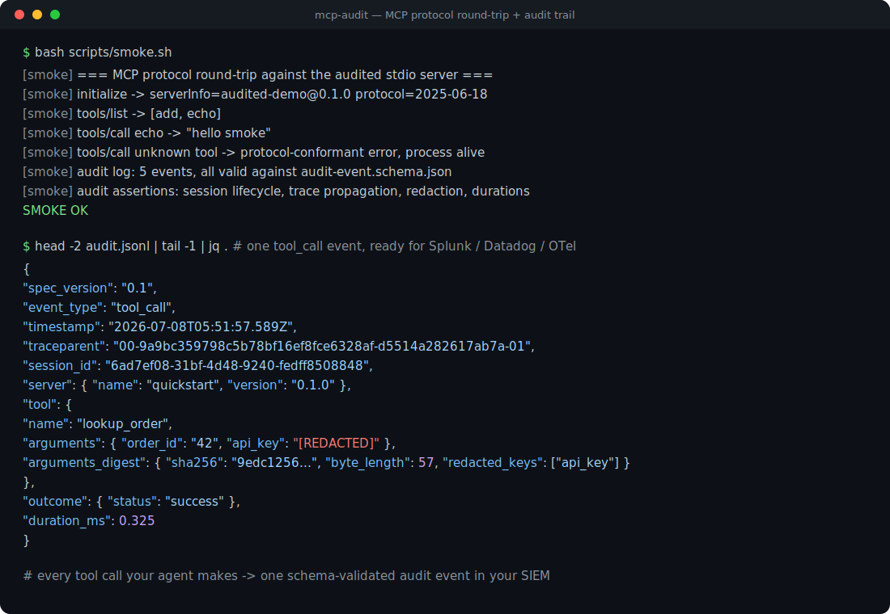
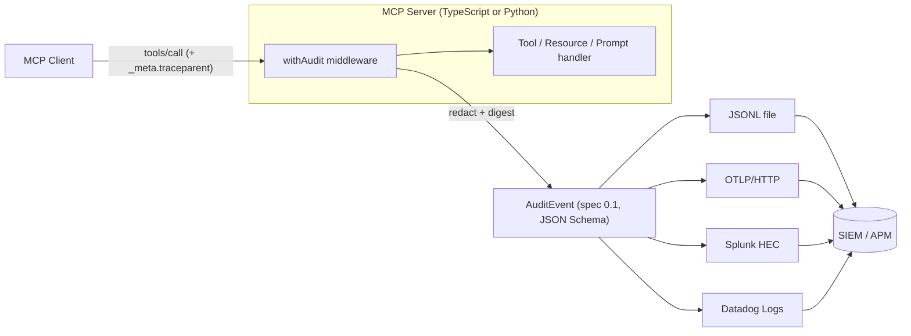

# mcp-audit

[English](README.md) | [中文](README.zh.md) | [日本語](README.ja.md)

 [](LICENSE) [](CHANGELOG.md) [](https://github.com/JaydenCJ/mcp-audit/discussions)

**MCP 監査ログのオープンソース標準。vendor-neutral なイベント schema と、Splunk・Datadog・OTLP エクスポーターを提供します。**



```bash
git clone https://github.com/JaydenCJ/mcp-audit.git && cd mcp-audit/ts && npm install && npm run build
```

## なぜ mcp-audit なのか

MCP の公式ロードマップは、SIEM/APM に接続できる構造化された監査証跡を未解決のギャップとして挙げています。NSA/CISA が 2026 年 6 月に公開した MCP 導入ガイダンスも、監査をエンタープライズ導入の最も弱い部分の 1 つとして指摘しています。一方で現状は、MCP トラフィックを監査する gateway 各社がそれぞれ独自のログ形式を発明しており、Splunk の検知ルールはベンダーをまたいで再利用できず、tool call をアプリケーション側の trace と結合することもできません。mcp-audit は**イベント schema を 1 つだけ**定義し（[SPEC.md](SPEC.md)、JSON Schema は [schema/](schema/)、MCP Extension 提案は [docs/sep-draft.md](docs/sep-draft.md)）、それを実運用に載せる middleware とエクスポーターを同梱します。gateway と競合するのではなく、補完する設計です。

|  | mcp-audit | MCP gateway（TrueFoundry、Lasso、IBM ContextForge） | 自前実装のログ |
|---|---|---|---|
| オープンなイベント schema（JSON Schema 2020-12） | yes | no（ベンダー独自形式） | no |
| リクエスト経路にプロキシ不要 | yes（インプロセス middleware） | no（gateway 必須） | yes |
| Splunk HEC / Datadog / OTLP エクスポーター | yes（3 種すべて、TS + Python） | ベンダーごとに異なる | 手書き |
| 全イベントに W3C Trace Context | yes | ベンダーごとに異なる | まれ |
| デフォルトで redaction + 完全性ダイジェスト | yes | ベンダーごとに異なる | no |
| ライセンス | MIT | 商用 / 混在 | — |

## 特徴

- **1 行で組み込める middleware** — `withAudit(server)` が既存の `@modelcontextprotocol/sdk` サーバーをそのまま計装します。gateway もプロキシも不要です。
- **シークレットはログに残りません** — 引数の redaction はデフォルトで有効です（機密キー名の deny-list とシークレット形状の値検出）。SHA-256 の正規化ダイジェストを併記するため、平文を保存せずに相関付けと改ざん検知ができます。
- **最初から SIEM ネイティブ** — Splunk HEC・Datadog Logs・OTLP/HTTP のエクスポーターを備え、フィールドマッピング表（Splunk CIM、Datadog 標準属性、OTel ログセマンティクス）を文書化しています。JSONL ファイルと console 出力にも対応しています。
- **trace と結合できます** — すべてのイベントが W3C `traceparent` を持ちます。`_meta.traceparent`（SEP-414 方式）付きのリクエストは、呼び出し元の trace をそのまま引き継ぎます。
- **schema は 1 つ、SDK は 2 つ** — TypeScript と Python が同一のイベントを生成し、クロス言語テストが両者を同じ JSON Schema で検証します。
- **標準であって、ロックインではありません** — schema・SPEC・SEP ドラフトこそが中核の成果物です。gateway ベンダーはこれを自社のエクスポート形式として採用できます。

## クイックスタート

**1. インストール**（Node.js >= 18）:

```bash
git clone https://github.com/JaydenCJ/mcp-audit.git && cd mcp-audit/ts && npm install && npm run build
```

**2. 監査付きの MCP セッションを確認します**（実サーバー + 実クライアントを同一プロセスで実行）:

```bash
node examples/quickstart.mjs
```

出力（実行結果そのまま、長い行は `...` で省略）:

```text
[mcp-audit] {"spec_version":"0.1","event_id":"a46e6df0-d032-4453-bc8f-fdbe154d1746","event_type":"session_start","timestamp":"2026-07-08T05:51:57.584Z","traceparent":"00-9a9bc359798c5b78bf16ef8fce6328af-6a12e0575d77cd93-01",...}
[mcp-audit] {"spec_version":"0.1","event_id":"c0a88e40-89eb-4de5-943e-38778d258caa","event_type":"tool_call",...,"tool":{"name":"lookup_order","arguments":{"order_id":"42","api_key":"[REDACTED]"},"arguments_digest":{"sha256":"9edc1256...","byte_length":57,"redacted_keys":["api_key"]}},...,"duration_ms":0.325}
[mcp-audit] {"spec_version":"0.1","event_id":"1ae93005-98c4-4aff-a826-0c632f83af60","event_type":"session_end",...,"duration_ms":6}
```

**3. 自分のサーバーを包みます**（このコードはテストがバイト単位でカバーしています）:

```ts
import { McpServer } from "@modelcontextprotocol/sdk/server/mcp.js";
import { z } from "zod";
import { withAudit, JsonlExporter } from "mcp-audit";

const server = withAudit(new McpServer({ name: "demo", version: "1.0.0" }), {
  exporters: [new JsonlExporter("./audit.jsonl")],
});
server.registerTool("echo", { inputSchema: { text: z.string() } }, async ({ text }) => ({
  content: [{ type: "text", text }],
}));
```

イベントを SIEM に直接送るにはエクスポーターを差し替えます。認証情報は環境変数から渡し、コードには書きません:

```ts
new OtlpHttpExporter({ endpoint: "http://127.0.0.1:4318/v1/logs" })
new SplunkHecExporter({ url: "https://splunk.example.com:8088", token: process.env.SPLUNK_HEC_TOKEN })
new DatadogExporter({ apiKey: process.env.DD_API_KEY, site: "datadoghq.com" })
```

**4. Python でも同じイベントを生成できます**（サードパーティ依存ゼロ）:

```python
from mcp_audit import AuditLogger, JsonlExporter

audit = AuditLogger(server_name="demo", server_version="1.0.0",
                    exporters=[JsonlExporter("./audit.jsonl")])

@audit.audited_tool("lookup_order")
def lookup_order(order_id: str, api_key: str) -> str:
    return f"order {order_id}: shipped"

lookup_order(order_id="42", api_key="sk-secret-value-1234567890")
```

**5. Claude Code から監査付きサーバーを起動します** — 次のスニペットをプロジェクトの `.mcp.json` に貼り付けます（ログは `node ts/scripts/validate-events.mjs audit.jsonl` でいつでも検証できます）:

```json
{
  "mcpServers": {
    "audited-demo": {
      "command": "node",
      "args": ["/absolute/path/to/mcp-audit/ts/examples/audited-server.mjs"],
      "env": {
        "MCP_AUDIT_LOG": "/absolute/path/to/audit.jsonl"
      }
    }
  }
}
```

## アーキテクチャ



イベントタイプは 6 種類（`tool_call`、`resource_read`、`prompt_invoke`、`session_start`、`session_end`、`error`）、JSON Schema は 1 つです。また、監査エクスポートの失敗が監査対象の処理を失敗させることはない、という一貫性ルールを定めています。フィールドの意味と SIEM マッピング表の全体は [SPEC.md](SPEC.md) を参照してください。

## ロードマップ

- [x] v0.1: イベント仕様 + JSON Schema、TypeScript `withAudit` middleware、Python SDK、5 種のエクスポーター、クロス言語適合テスト、stdio ラウンドトリップ smoke テスト
- [ ] MCP 仕様リポジトリへの SEP 提出と Extension 登録プロセスの推進
- [ ] HTTP エクスポーターのバッファリング/バッチ送信（リトライとバックプレッシャー付き）
- [ ] 長時間タスクと sampling/elicitation フローの監査イベント（仕様 v0.2）
- [ ] 既存 gateway（IBM ContextForge、Lasso）向けエクスポートアダプターと OCSF マッピング

全体は [open issues](https://github.com/JaydenCJ/mcp-audit/issues) を参照してください。

## コントリビューション

コントリビューションを歓迎します。まずは [good first issue](https://github.com/JaydenCJ/mcp-audit/issues?q=is%3Aissue+is%3Aopen+label%3A%22good+first+issue%22) から、または [Discussions](https://github.com/JaydenCJ/mcp-audit/discussions) でお気軽にどうぞ。PR を送る前にテストを実行してください:

```bash
cd ts && npm test
cd python && python3 -m unittest discover -s tests -v
bash scripts/smoke.sh
```

## ライセンス

[MIT](LICENSE)
