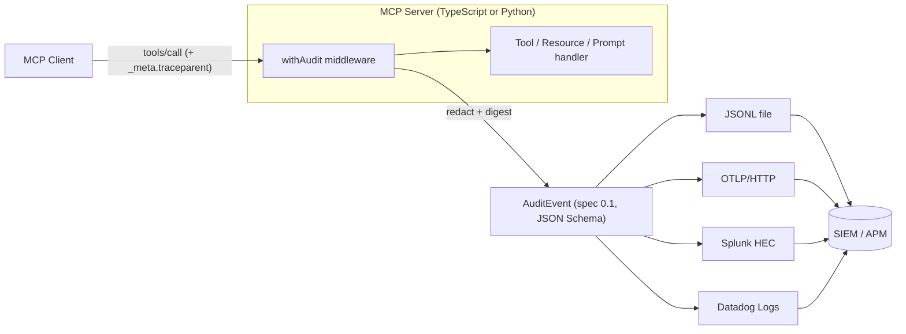

# mcp-audit

[English](README.md) | [中文](README.zh.md) | [日本語](README.ja.md)

 [](LICENSE) [](CHANGELOG.md) [](https://github.com/JaydenCJ/mcp-audit/discussions)

**An open-source audit-log standard for MCP — one vendor-neutral event schema, with Splunk, Datadog and OTLP exporters.**


```bash
git clone https://github.com/JaydenCJ/mcp-audit.git && cd mcp-audit/ts && npm install && npm run build
```

## Why mcp-audit?

The official MCP roadmap lists structured audit trails that can feed SIEM/APM systems as an open gap, and the NSA/CISA guidance on MCP deployments (June 2026) flags audit as one of the weakest links in enterprise rollouts. Meanwhile, every gateway that audits MCP traffic today invents a private log format: your Splunk detection rules do not port between vendors, and a tool call cannot be joined with your application traces. mcp-audit specifies **one event schema** ([SPEC.md](SPEC.md), JSON Schema in [schema/](schema/), MCP Extension proposal in [docs/sep-draft.md](docs/sep-draft.md)) and ships the middleware plus exporters that put it to work — it complements gateways instead of competing with them.

|  | mcp-audit | MCP gateways (TrueFoundry, Lasso, IBM ContextForge) | DIY logging |
|---|---|---|---|
| Open event schema (JSON Schema 2020-12) | yes | no (vendor-private formats) | no |
| Works without a proxy in the request path | yes (in-process middleware) | no (gateway required) | yes |
| Splunk HEC / Datadog / OTLP exporters | yes (all three, TS + Python) | vendor-specific | hand-written |
| W3C Trace Context on every event | yes | vendor-specific | rarely |
| Redaction on by default + integrity digest | yes | vendor-specific | no |
| License | MIT | commercial / mixed | — |

## Features

- **Drop-in middleware** — `withAudit(server)` instruments an existing `@modelcontextprotocol/sdk` server in one line; no gateway, no proxy in your request path.
- **Secrets stay out of your logs** — argument redaction is on by default (deny-list keys plus secret-shaped values), and a SHA-256 canonical digest keeps records correlatable and tamper-evident without storing the payload.
- **SIEM-native from day one** — exporters for Splunk HEC, Datadog Logs and OTLP/HTTP with documented field mappings (Splunk CIM, Datadog standard attributes, OTel log semantics), plus JSONL file and console.
- **Joins your traces** — every event carries a W3C `traceparent`; requests arriving with `_meta.traceparent` (SEP-414 style) continue the caller's trace end to end.
- **One schema, two SDKs** — TypeScript and Python emit identical events, and a cross-language test suite validates both against the same JSON Schema.
- **A standard, not a lock-in** — the schema, SPEC and SEP draft are the core deliverable; gateways can adopt the format as their export target instead of competing with it.

## Quickstart

**1. Install** (Node.js >= 18):

```bash
git clone https://github.com/JaydenCJ/mcp-audit.git && cd mcp-audit/ts && npm install && npm run build
```

**2. Watch a fully audited MCP session** (real server + real client in one process):

```bash
node examples/quickstart.mjs
```

Output (real run, long lines truncated with `...`):

```text
[mcp-audit] {"spec_version":"0.1","event_id":"a46e6df0-d032-4453-bc8f-fdbe154d1746","event_type":"session_start","timestamp":"2026-07-08T05:51:57.584Z","traceparent":"00-9a9bc359798c5b78bf16ef8fce6328af-6a12e0575d77cd93-01",...}
[mcp-audit] {"spec_version":"0.1","event_id":"c0a88e40-89eb-4de5-943e-38778d258caa","event_type":"tool_call",...,"tool":{"name":"lookup_order","arguments":{"order_id":"42","api_key":"[REDACTED]"},"arguments_digest":{"sha256":"9edc1256...","byte_length":57,"redacted_keys":["api_key"]}},...,"duration_ms":0.325}
[mcp-audit] {"spec_version":"0.1","event_id":"1ae93005-98c4-4aff-a826-0c632f83af60","event_type":"session_end",...,"duration_ms":6}
```

**3. Wrap your own server** (this exact snippet is covered byte-for-byte by a test):

```ts
import { McpServer } from "@modelcontextprotocol/sdk/server/mcp.js";
import { z } from "zod";
import { withAudit, JsonlExporter } from "mcp-audit";

const server = withAudit(new McpServer({ name: "demo", version: "1.0.0" }), {
  exporters: [new JsonlExporter("./audit.jsonl")],
});
server.registerTool("echo", { inputSchema: { text: z.string() } }, async ({ text }) => ({
  content: [{ type: "text", text }],
}));
```

To ship events to your SIEM instead of a file, swap the exporter — credentials come from your environment, never from code:

```ts
new OtlpHttpExporter({ endpoint: "http://127.0.0.1:4318/v1/logs" })
new SplunkHecExporter({ url: "https://splunk.example.com:8088", token: process.env.SPLUNK_HEC_TOKEN })
new DatadogExporter({ apiKey: process.env.DD_API_KEY, site: "datadoghq.com" })
```

**4. Same events from Python** (zero third-party dependencies):

```python
from mcp_audit import AuditLogger, JsonlExporter

audit = AuditLogger(server_name="demo", server_version="1.0.0",
                    exporters=[JsonlExporter("./audit.jsonl")])

@audit.audited_tool("lookup_order")
def lookup_order(order_id: str, api_key: str) -> str:
    return f"order {order_id}: shipped"

lookup_order(order_id="42", api_key="sk-secret-value-1234567890")
```

**5. Run an audited server from Claude Code** — paste into your project's `.mcp.json` (then validate the log anytime with `node ts/scripts/validate-events.mjs audit.jsonl`):

```json
{
  "mcpServers": {
    "audited-demo": {
      "command": "node",
      "args": ["/absolute/path/to/mcp-audit/ts/examples/audited-server.mjs"],
      "env": {
        "MCP_AUDIT_LOG": "/absolute/path/to/audit.jsonl"
      }
    }
  }
}
```

## Architecture



Six event types (`tool_call`, `resource_read`, `prompt_invoke`, `session_start`, `session_end`, `error`), one JSON Schema, and a conformance rule: audit export failures never fail the audited operation. Field semantics and the full SIEM mapping tables live in [SPEC.md](SPEC.md).

## Roadmap

- [x] v0.1: event spec + JSON Schema, TypeScript `withAudit` middleware, Python SDK, five exporters, cross-language conformance suite, stdio round-trip smoke test
- [ ] Submit the SEP to the MCP specification repository and track Extension registration
- [ ] Buffered/batched HTTP export with retry and backpressure
- [ ] Audit events for long-running tasks and sampling/elicitation flows (spec v0.2)
- [ ] Export adapters for existing gateways (IBM ContextForge, Lasso) and an OCSF mapping

See the [open issues](https://github.com/JaydenCJ/mcp-audit/issues) for the full list.

## Contributing

Contributions are welcome — start with a [good first issue](https://github.com/JaydenCJ/mcp-audit/issues?q=is%3Aissue+is%3Aopen+label%3A%22good+first+issue%22) or open a [discussion](https://github.com/JaydenCJ/mcp-audit/discussions). Run the test suites before sending a PR:

```bash
cd ts && npm test
cd python && python3 -m unittest discover -s tests -v
bash scripts/smoke.sh
```

## License

[MIT](LICENSE)
