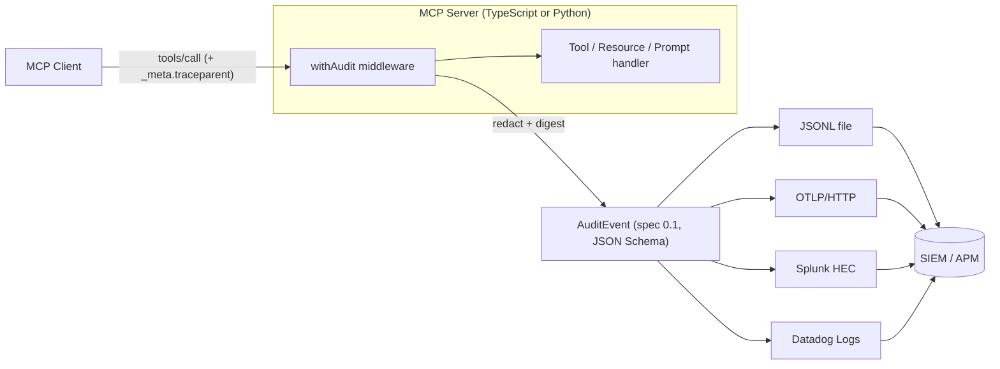

# mcp-audit

[English](README.md) | [中文](README.zh.md) | [日本語](README.ja.md)

 [](LICENSE) [](CHANGELOG.md) [](https://github.com/JaydenCJ/mcp-audit/discussions)

**MCP 审计日志的开源标准——一份 vendor-neutral 的事件 schema，附带 Splunk、Datadog、OTLP 导出器。**


```bash
git clone https://github.com/JaydenCJ/mcp-audit.git && cd mcp-audit/ts && npm install && npm run build
```

## 为什么是 mcp-audit？

MCP 官方路线图把"可接入 SIEM/APM 的结构化审计追踪"列为待补的缺口，NSA/CISA 2026 年 6 月发布的 MCP 部署指引也把审计点名为企业落地中最薄弱的环节之一。而现实是：今天每一家做 MCP 审计的网关都在发明自己的私有日志格式——你写好的 Splunk 检测规则换一家厂商就作废，一次 tool call 也没法和应用侧的 trace 关联起来。mcp-audit 只定义**一份事件 schema**（[SPEC.md](SPEC.md)，JSON Schema 见 [schema/](schema/)，MCP Extension 提案见 [docs/sep-draft.md](docs/sep-draft.md)），并配齐让它落地的中间件与导出器——它是网关的互补品，不是竞争者。

|  | mcp-audit | MCP 网关（TrueFoundry、Lasso、IBM ContextForge） | 自研日志 |
|---|---|---|---|
| 开放事件 schema（JSON Schema 2020-12） | yes | no（厂商私有格式） | no |
| 请求路径上无需代理 | yes（进程内中间件） | no（必须过网关） | yes |
| Splunk HEC / Datadog / OTLP 导出器 | yes（三者齐备，TS + Python） | 因厂商而异 | 手写 |
| 每条事件带 W3C Trace Context | yes | 因厂商而异 | 少见 |
| 默认开启脱敏 + 完整性摘要 | yes | 因厂商而异 | no |
| 许可证 | MIT | 商业 / 混合 | — |

## 特性

- **一行接入的中间件** —— `withAudit(server)` 直接包装现有 `@modelcontextprotocol/sdk` server，请求路径上不加网关、不加代理。
- **密钥进不了日志** —— 参数脱敏默认开启（敏感键名 deny-list + 密钥形态值识别），同时保留 SHA-256 规范化摘要，不存明文也能做关联与防篡改校验。
- **生来就是 SIEM 的格式** —— Splunk HEC、Datadog Logs、OTLP/HTTP 三路导出器，字段映射表齐全（Splunk CIM、Datadog 标准属性、OTel 日志语义），另有 JSONL 文件与 console 导出。
- **和你的 trace 接得上** —— 每条事件都带 W3C `traceparent`；请求经 `_meta.traceparent`（SEP-414 风格）带入的 trace 会被端到端延续。
- **一份 schema，两套 SDK** —— TypeScript 与 Python 产出完全一致的事件，跨语言测试套件用同一份 JSON Schema 校验两侧。
- **是标准，不是锁定** —— schema、SPEC 与 SEP 草稿才是核心交付物；网关厂商可以把它当作自己的导出格式，而不是对手。

## 快速开始

**1. 安装**（Node.js >= 18）：

```bash
git clone https://github.com/JaydenCJ/mcp-audit.git && cd mcp-audit/ts && npm install && npm run build
```

**2. 看一次被完整审计的 MCP 会话**（真实 server + 真实 client 同进程运行）：

```bash
node examples/quickstart.mjs
```

输出（真实运行结果，长行以 `...` 截断）：

```text
[mcp-audit] {"spec_version":"0.1","event_id":"a46e6df0-d032-4453-bc8f-fdbe154d1746","event_type":"session_start","timestamp":"2026-07-08T05:51:57.584Z","traceparent":"00-9a9bc359798c5b78bf16ef8fce6328af-6a12e0575d77cd93-01",...}
[mcp-audit] {"spec_version":"0.1","event_id":"c0a88e40-89eb-4de5-943e-38778d258caa","event_type":"tool_call",...,"tool":{"name":"lookup_order","arguments":{"order_id":"42","api_key":"[REDACTED]"},"arguments_digest":{"sha256":"9edc1256...","byte_length":57,"redacted_keys":["api_key"]}},...,"duration_ms":0.325}
[mcp-audit] {"spec_version":"0.1","event_id":"1ae93005-98c4-4aff-a826-0c632f83af60","event_type":"session_end",...,"duration_ms":6}
```

**3. 包装你自己的 server**（下面这段代码有测试逐字节覆盖）：

```ts
import { McpServer } from "@modelcontextprotocol/sdk/server/mcp.js";
import { z } from "zod";
import { withAudit, JsonlExporter } from "mcp-audit";

const server = withAudit(new McpServer({ name: "demo", version: "1.0.0" }), {
  exporters: [new JsonlExporter("./audit.jsonl")],
});
server.registerTool("echo", { inputSchema: { text: z.string() } }, async ({ text }) => ({
  content: [{ type: "text", text }],
}));
```

要把事件直接送进 SIEM，换一个导出器即可——凭证一律来自环境变量，不写进代码：

```ts
new OtlpHttpExporter({ endpoint: "http://127.0.0.1:4318/v1/logs" })
new SplunkHecExporter({ url: "https://splunk.example.com:8088", token: process.env.SPLUNK_HEC_TOKEN })
new DatadogExporter({ apiKey: process.env.DD_API_KEY, site: "datadoghq.com" })
```

**4. Python 侧产出同样的事件**（零第三方依赖）：

```python
from mcp_audit import AuditLogger, JsonlExporter

audit = AuditLogger(server_name="demo", server_version="1.0.0",
                    exporters=[JsonlExporter("./audit.jsonl")])

@audit.audited_tool("lookup_order")
def lookup_order(order_id: str, api_key: str) -> str:
    return f"order {order_id}: shipped"

lookup_order(order_id="42", api_key="sk-secret-value-1234567890")
```

**5. 在 Claude Code 里运行一个被审计的 server** —— 把下面片段粘进项目的 `.mcp.json`（之后可随时用 `node ts/scripts/validate-events.mjs audit.jsonl` 校验日志）：

```json
{
  "mcpServers": {
    "audited-demo": {
      "command": "node",
      "args": ["/absolute/path/to/mcp-audit/ts/examples/audited-server.mjs"],
      "env": {
        "MCP_AUDIT_LOG": "/absolute/path/to/audit.jsonl"
      }
    }
  }
}
```

## 架构



六种事件类型（`tool_call`、`resource_read`、`prompt_invoke`、`session_start`、`session_end`、`error`），一份 JSON Schema，以及一条一致性铁律：审计导出失败绝不影响被审计的操作本身。字段语义与完整的 SIEM 映射表见 [SPEC.md](SPEC.md)。

## 路线图

- [x] v0.1：事件规范 + JSON Schema、TypeScript `withAudit` 中间件、Python SDK、五个导出器、跨语言一致性测试、stdio 协议往返 smoke 测试
- [ ] 向 MCP 规范仓库提交 SEP，跟进 Extension 注册流程
- [ ] HTTP 导出器的缓冲/批量发送，含重试与背压
- [ ] 长时任务与 sampling/elicitation 流程的审计事件（规范 v0.2）
- [ ] 面向现有网关（IBM ContextForge、Lasso）的导出适配器与 OCSF 映射

完整列表见 [open issues](https://github.com/JaydenCJ/mcp-audit/issues)。

## 参与贡献

欢迎贡献——从 [good first issue](https://github.com/JaydenCJ/mcp-audit/issues?q=is%3Aissue+is%3Aopen+label%3A%22good+first+issue%22) 入手，或到 [Discussions](https://github.com/JaydenCJ/mcp-audit/discussions) 发起讨论。提交 PR 前请先跑通测试：

```bash
cd ts && npm test
cd python && python3 -m unittest discover -s tests -v
bash scripts/smoke.sh
```

## 许可证

[MIT](LICENSE)
